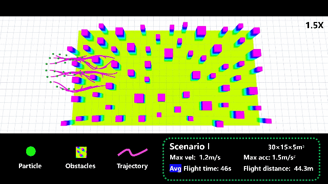

# SPH-planning

**Swarm Navigation Framework Based on Smoothed Particle Hydrodynamics**

<p align="center">
  
  <br>
  
  
</p>

If you are interested in swarm navigation in cluttered environments, this repository provides an SPH-based navigation framework for robot swarms. The core of our work is presented in the paper:

> **Swarm Navigation Based on Smoothed Particle Hydrodynamics in Complex Obstacle Environments**
> by Ruocheng Li, Bin Xin, Shuai Zhang, Mingzhe Lyu, and Jinqiang Cui
> published in *IEEE Robotics and Automation Letters*, 2025.

If you find this work useful, please cite our paper:

```
@article{li2025swarm,
  title={Swarm Navigation Based on Smoothed Particle Hydrodynamics in Complex Obstacle Environments},
  author={Li, Ruocheng and Xin, Bin and Zhang, Shuai and Lyu, Mingzhe and Cui, Jinqiang},
  journal={IEEE Robotics and Automation Letters},
  year={2025},
  publisher={IEEE}
}
```

📺 **Video demonstration**: [https://www.youtube.com/watch?v=4ux7pRI9-Wo](https://www.youtube.com/watch?v=4ux7pRI9-Wo)

This project partially refers to the excellent implementation of [Fast-Planner](https://github.com/HKUST-Aerial-Robotics/Fast-Planner), and we sincerely thank the authors for their contributions.

---

## 🔧 Installation and Setup

**Tested Environment**:

* Ubuntu 20.04
* ROS Noetic

### 1. Install dependencies

The SPH framework requires the `NLOPT` optimization library. Please refer to the official documentation:
👉 [https://nlopt.readthedocs.io/en/latest/NLopt\_Installation/](https://nlopt.readthedocs.io/en/latest/NLopt_Installation/)

### 2. Clone and compile

```bash
mkdir -p sph_planning_ws/src
cd sph_planning_ws/src
git clone https://github.com/SmartGroupSystems/SPH-planning.git
cd ..
catkin_make
```

### 3. Run the simulation

In terminal window 1:

```bash
cd sph_planning_ws
source devel/setup.bash
roslaunch water_swarm simulator.launch
```

Then open terminal window 2:

```bash
cd sph_planning_ws
source devel/setup.bash
roslaunch water_swarm sph.launch
```

At this point, an RViz simulation interface will appear. Use the **2D Nav Goal** tool to click on a target position — if everything works correctly, you will observe the swarm of particles dynamically navigating toward the selected goal.

---

## ✈️ Real-World Experiments

In our physical experiments, we used omni-directional vision drones. If you're interested in conducting similar swarm experiments, you can check out the hardware platform we used here (not a sponsored link):

👉 [https://e.tb.cn/h.h2lyknv0Acds4eq?tk=7BTfVuqPjjn](https://e.tb.cn/h.h2lyknv0Acds4eq?tk=7BTfVuqPjjn)

These drones are compact in size, which greatly simplifies swarm deployment and testing in practice.

Note: The real-world experiments involve many engineering tricks and low-level configurations that depend on specific hardware platforms. Moreover, instead of using ROS-native communication, we implemented a lightweight **UDP-based position broadcasting** system for inter-robot communication. The details of this communication protocol and its implementation will be gradually released in future updates.

---

If you have any questions, please feel free to open an issue or contact us at:
📬 **[ruochengli@bit.edu.cn](mailto:ruochengli@bit.edu.cn)**

